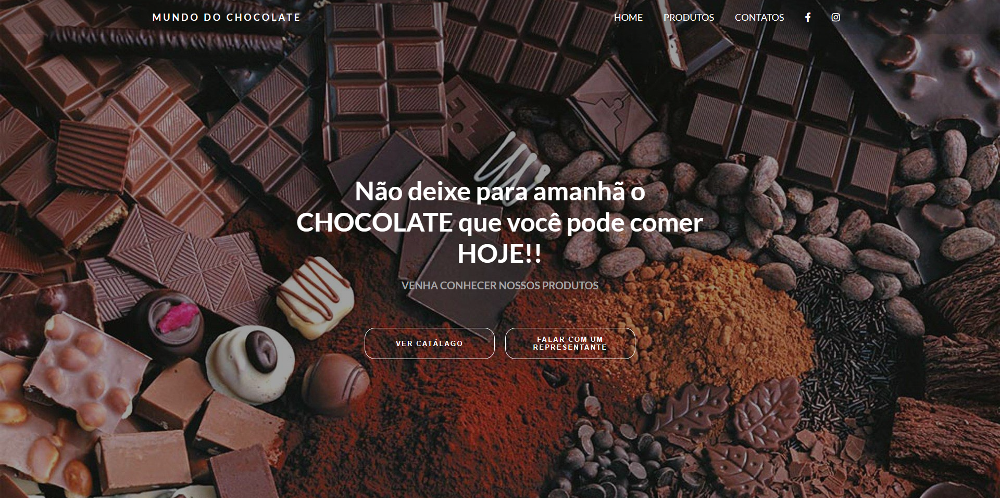

<h1 align="center">Mundo Chocolate</h1>

  

### Projeto

É um site de produto (chocolate) desenvolvido com as tecnologias : HTML e CSS.

- [Visite o projeto online](https://mundo-chocolate.vercel.app/)

Esse projeto foi feito por Naah Carvalho ♥
